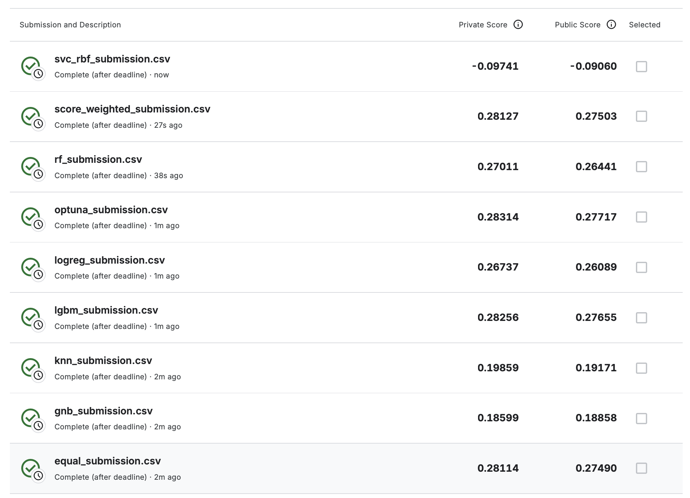

# ML Start hw02 -- [Porto Seguro’s Safe Driver Prediction](https://www.kaggle.com/competitions/porto-seguro-safe-driver-prediction)

> Сорочан Дмитрий · [Telegram](https://t.me/legenda0008) · [Kaggle](https://www.kaggle.com/dmitrysorochan)

## Результаты

[Лучшее решение](outputs/optuna_submission.csv).

| Submission | Private Gini | Public Gini |
|---|---:|---:|
| **`optuna_submission.csv`** | **0.28314** | **0.27717** |
| `lgbm_submission.csv` | 0.28256 | 0.27655 |
| `score_weighted_submission.csv` | 0.28127 | 0.27503 |
| `equal_submission.csv` | 0.28114 | 0.27490 |
| `rf_submission.csv` | 0.27011 | 0.26441 |
| `logreg_submission.csv` | 0.26737 | 0.26089 |
| `knn_submission.csv` | 0.19859 | 0.19171 |
| `gnb_submission.csv` | 0.18599 | 0.18858 |
| `svc_rbf_submission.csv` | -0.09741 | -0.09060 |

По Private Gini результат соответствовал бы **2665 месту из 5156**, то есть примерно **топ-51.7%**.



## Подход

1. Единая `StratifiedKFold` на 5 фолдов и Normalized Gini.
2. Feature engineering через Random Forest; в финальных моделях PCA не используется.
3. Проверены GaussianNB, Logistic Regression, Random Forest, LightGBM, RBF-SVC и KNN.
4. Вся обучаемая предобработка выполняется внутри CV-пайплайнов.
5. Гиперпараметры подбираются Optuna с общим лимитом 3 часа на study.
6. Для моделей получены OOF- и test-предсказания.
7. Финальный rank blend строится из Logistic Regression, Random Forest и LightGBM.

RBF-SVC и KNN обучались на стратифицированных подвыборках внутри каждого фолда, поскольку точные методы плохо масштабируются на весь датасет.

## Выводы

- LightGBM -- лучшая одиночная модель;
- Optuna-бленд улучшил LightGBM до `0.28314` Private и `0.27717` Public;
- Random Forest дал полезное разнообразие для ансамбля;
- GaussianNB и KNN оказались слабыми;
- RBF-SVC получил отрицательный Gini;
- слабые модели не добавлялись в финальный бленд только ради низкой корреляции.

## Структура

```text
.
├── 00_EDA.ipynb
├── 01_feature_engineering.ipynb
├── 02_modeling.ipynb
├── data/
│   └── download_data.py
├── outputs/
│   ├── scores.png
│   ├── gnb_submission.csv
│   ├── logreg_submission.csv
│   ├── rf_submission.csv
│   ├── lgbm_submission.csv
│   ├── svc_rbf_submission.csv
│   ├── knn_submission.csv
│   ├── equal_submission.csv
│   ├── score_weighted_submission.csv
│   └── optuna_submission.csv
├── statement/
├── .gitignore
└── README.md
```

## Запуск

```bash
python3 -m pip install -U \
    numpy pandas matplotlib seaborn scipy \
    scikit-learn lightgbm optuna kaggle jupyter
```

```bash
python3 data/download_data.py
```

Ноутбуки запускаются по порядку:

```text
00_EDA.ipynb
01_feature_engineering.ipynb
03_models.ipynb
```
